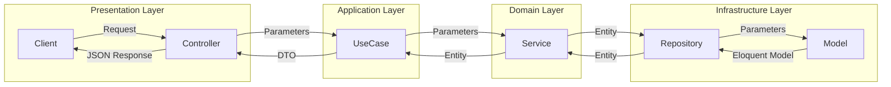

# VetIQ
動物病院の予約＆口コミ アプリ

## Included services
- Nginx
- PHP 8.3.0
- MySQL 8.0
- Redis
- Adminer
- Redis Commander
- Mailhog (Mailcatcher alternative)
- Swagger UI

## Framework
- Laravel ^11.9

## Project Setup

1. Clone this repo:

```
git clone git@github.com/lmlucania/vetiq.git
cd vetiq
```

2. Create ```.env``` file

```
cp .env.example .env
cp src/.env.example src/.env
```

3. Build and run containers:

```
docker-compose build
docker-compose up
```

4. Set Up the Application Environment
```
composer install
php artisan key:generate

# DBのマイグレーションとシーダーを実行
php artisan migrate:refresh --seed
```


## API Document

### URL

```
localhost:8080/request-docs
```

### Generate OpenAPI collection as json file

```
php artisan laravel-request-docs:export
```

### Architecture


#### DDD


